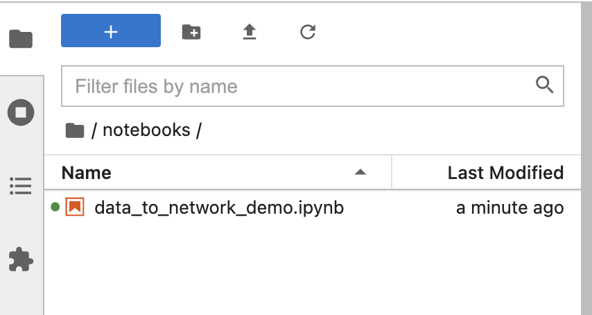

# Biological Clocks class

This repository contains material for the Duke University class Biological Clocks.

Requirements
------------
### Conda
* You will need [Conda](https://conda.io/projects/conda/en/latest/index.html) installed. Conda is a package and environment manager and is included in all versions of [Anaconda](https://www.anaconda.com/products/individual) and [Miniconda](https://docs.conda.io/en/latest/miniconda.html). Installation instructions can be found [here](https://conda.io/projects/conda/en/latest/user-guide/install/index.html).

### MPI
* If you do not have `MPI` installed:
  * For MacOS and in a terminal, enter:
    ```
    $ brew --version || /bin/bash -c "$(curl -fsSL https://raw.githubusercontent.com/Homebrew/install/HEAD/install.sh)"
    $ brew install openmpi
    $ mpiexec --version
    ```
  * For Ubuntu and in a terminal, enter:
    ```
    $ sudo apt-get install openmpi-bin
    $ mpiexec --version
    ```
  * For Windows:
    * first install Microsoft MPI from Here: https://www.microsoft.com/en-us/download/details.aspx?id=54607
    * Next, add the path `C:\Program Files\Microsoft MPI\bin` to the PATH 
environment variable. To do so, start typing "env" in the search bar on 
Windows, choose Edit environment variables. Select the Advanced tab and 
click on Environment variables. Under User variables, select Path and 
click the Edit button. Select New and paste the path above, then hit Ok 
on all open windows.

<!-- The windows structures follow the instructions here: https://urldefense.com/v3/__https://nyu-cds.github.io/python-mpi/setup/__;!!OToaGQ!4UHBCE2f2xWnrMbT1RvtFuLlDLZs9tJptxOQa5OWNNFQkAMrrhDEdqD1FnoCIm_0ja_U$ -->

### Git
* [Git](https://www.atlassian.com/git/tutorials/what-is-git) is a version control system and can be installed via conda. In your terminal, enter the command:

  ```
  $ conda install git
  ```
### Gitlab ([www.gitlab.com](https://www.gitlab.com))
* You will also need to create a Gitlab account, which you can do [here](https://gitlab.com/users/sign_up). 
* You will likely need to create a Personal Access Token (PAT) for use during the Installation step. Follow the steps below to make a Personal Access Token. **IMPORTANT: You will need this token in the Installation instructions below. When you make it, save it some where temporary.**
    * Logged into your GitLab account, click your profile [1] go to `Preferences` [2].
    
    * Go to the `Access Tokens` [1]. Enter `duke-vm` for the Token name [2] and click the box next to `api` [3]. Click `Create personal access token` [4].
    
    * You will be directed to a new page. Copy the text in the box under `Your new personal access token`. **IMPORTANT: Again, you will need this token in the Installation instructions below. Leave this page open. If you close this page, you will not be able to get your token back. If you do close it, you will need to create a new token again.**
    * The above will be sufficient for this course, but to learn more on creating a PAT, click [here](https://docs.gitlab.com/ee/user/profile/personal_access_tokens.html). 


<br>Installation
------------

* Clone the repository onto your machine by entering the following command in your terminal. Note that if you have a Windows machine, this command should be run in a cmd (Command Prompt) terminal instead of the Conda terminal. To open cmd, see [here](https://www.howtogeek.com/235101/10-ways-to-open-the-command-prompt-in-windows-10/#:~:text=Press%20Windows%2BR%20to%20open,open%20an%20administrator%20Command%20Prompt).
  ```
  $ git clone https://gitlab.com/haaselab/biological_clocks_class.git
  ```
* You will be prompted to enter your Gitlab username and password. Enter your username but for the password use your PAT.
* Change into the `biological_clocks_class` directory, create a conda environment and install packages. To learn more about the command line and commands such as "cd" (change directory) below, see this [crash course](https://developer.mozilla.org/en-US/docs/Learn/Tools_and_testing/Understanding_client-side_tools/Command_line).
  ```
  $ cd biological_clocks_class
  $ git submodule init
  $ git submodule update
  $ conda env create -f conda_req.yml
  $ conda activate BioClocksClass
  $ ipython kernel install --user --name=BioClocksClass
  ```
  * **FOR WINDOWS USERS**, after following the above steps, enter this command:
    ```
    $ pip install mpi4py
    ```
_________________________
<br>Opening Jupyter Lab
------------
* Make sure you are in the `biological_clocks_class` folder.
* Then activate the conda environment for this class if you haven't already. The command is:
  ```
  $ conda activate BioClocksClass
  ```
* Next, activate Jupyter Lab by entering the following command:
  ```
  $ jupyter lab
  ```
* A browser should open up or, if you have a browser open already, a new tab should open up.

<br>Creating a new notebook in Jupyter Lab
------------
* Make sure you have activated the `BioClocksClass` conda environment and then Jupyter Lab.
* Navigate to the `notebooks` folder in the `biological_clocks_class` folder within Jupyter Lab. You will find the data_to_network_demo.ipynb file there.
* 

* Click the "+" (plus sign), which will open a "Launcher" window in Jupyter Lab.
* Under the "Notebook" section, select the square that says "BioClocksClass". NOTE: if code in this new notebook isn't working, you may need to create a new notebook in the same manner except, under the "Notebook" section, select the square that says "Python [conda env:BioClocksClass]".
* To use the functions provided, you must enter `%run -i ../src/utilities.py` into a cell and run that cell.
* 

* Your new notebook will be named "Untitled.ipynb" so make sure to rename it!

_________________________

<br>Tools
------------
* These are installed during Installation
* For a comparative analysis of various periodicity algorithms, inlcuding pyJTK, pyDL and Lomb-Scargle, read this [article](https://www.ncbi.nlm.nih.gov/pmc/articles/PMC4471443/).
<table>
    <thead>
      <tr>
        <th>Tool</th><th>Description</th><th>PMID</th><th>Repo Link</th>
      </tr>
    </thead>
    <tbody>
      <tr><td>pyJTK</td><td>Correlates a gene’s expression profile to that of a reference curve with known periodicity properties, and computes a significance of that correlation.</td><td><a href="https://pubmed.ncbi.nlm.nih.gov/20876817/">20876817</a></td><td><a href="https://gitlab.com/biochron/pyjtk">GitLab</a></td></tr>
      <tr><td>pyDL</td><td>Measures how periodic a signal is at a specified period by quantifying and combining statistical measures of gene expression periodicity and strength of regulation.</td><td><a href="https://pubmed.ncbi.nlm.nih.gov/15513999/">15513999</a></td><td><a href="https://gitlab.com/biochron/pydl">GitLab</a></td></tr>
      <tr><td>Lomb-Scargle</td><td>Measures the correspondence to sinusoidal curves and determines their statistical significance. Can handle unevenly sampled data.</td><td><a href="https://pubmed.ncbi.nlm.nih.gov/16303799/">16303799</a></td><td>N/A</td></tr>
      <tr><td>The Local Edge Machine (LEM)</td><td>A Bayesian network inference method which ranks potential models of gene interactions to identify the most likely regulator(s) and modes of regulation (activation or repression) of a given target gene using time series gene expression data. </td><td><a href="https://pubmed.ncbi.nlm.nih.gov/27760556/">27760556</a></td><td><a href="https://gitlab.com/biochron/lempy">GitLab</a></td></tr>
    </tbody>
</table>
<br>

### **Description of periodicity results of interest.**

pyJTK - a single file is returned. 

* period: the period in the range specified by you for which a given gene obtained the best p-value
* p-value: the p-value associated with the period (periodicity score)

pyDL - a single file is returned

* p_reg_norm: the amplitude score for a given gene
* p_per_norm: the periodicity score for a given gene
* dl_score: the dl score (a combination of the amplitude and periodocty score) for a given gene

Lomb-Scarlge (LS) - a directory is returned. The file of interest ends with `_summary.tsv`

* period: the period in the range specified by you for which a given gene obtained the best p-value
* p-value: the p-value associated with the period (periodicity score)

_________________________
<br>Datasets
------------

Below is a table describing the datasets available within this repository. The last column, titled PMID, contains the pubmed ID for the article the dataset is associated with. Clicking the ID will link you to the article on Pubmed.
<br>

<table>
    <thead>
      <tr>
        <th>Organism</th><th>Process</th><th>Condition</th><th>Sampling Frequency</th><th>Sampling Duration</th><th>Dataset</th><th>Type</th><th>PMID</th>
      </tr>
    </thead>
        <tbody>
            <tr><td>Saccharomyces cerevisiae</td><td>Cell Cycle</td><td>Wild-type replicate 1</td><td>16 min</td><td>254 min</td><td>Scerevisiae_WT1_Microarray</td><td>Microarray</td><td><a href="https://pubmed.ncbi.nlm.nih.gov/18463633/">18463633</a></td></tr>
            <tr><td>Saccharomyces cerevisiae</td><td>Cell Cycle</td><td>Wild-type replicate 2</td><td>16 min</td><td>262 min</td><td>Scerevisiae_WT2_Microarray</td><td>Microarray</td><td><a href="https://pubmed.ncbi.nlm.nih.gov/18463633/">18463633</a></td></tr>
            <tr><td>Saccharomyces cerevisiae</td><td>Cell Cycle</td><td>Wild-type</td><td>5 min</td><td>245 min</td><td>Scerevisiae_RNAseq</td><td>RNAseq</td><td><a href="https://pubmed.ncbi.nlm.nih.gov/27918582/">27918582</a></td></tr>
            <tr><td>Saccharomyces cerevisiae</td><td>Cell Cycle</td><td>No APC activity replicate 1</td><td>20 min</td><td>300 min</td><td>Scerevisiae_noAPC_r1</td><td>Microarray</td><td><a href="https://pubmed.ncbi.nlm.nih.gov/25200947/">25200947</a></td></tr>
            <tr><td>Saccharomyces cerevisiae</td><td>Cell Cycle</td><td>No APC activity replicate 2</td><td>20 min</td><td>360 min</td><td>Scerevisiae_noAPC_r2</td><td>Microarray</td><td><a href="https://pubmed.ncbi.nlm.nih.gov/25200947/">25200947</a></td></tr>
            <tr><td>Saccharomyces cerevisiae</td><td>Cell Cycle</td><td>No cyclin-CDK activity replicate 1</td><td>16 min</td><td>262 min</td><td>Scerevisiae_noCDK_r1</td><td>Microarray</td><td><a href="https://pubmed.ncbi.nlm.nih.gov/18463633/">18463633</a></td></tr>
            <tr><td>Saccharomyces cerevisiae</td><td>Cell Cycle</td><td>No cyclin-CDK activity replicate 2</td><td>16 min</td><td>254 min</td><td>Scerevisiae_noCDK_r2</td><td>Microarray</td><td><a href="https://pubmed.ncbi.nlm.nih.gov/18463633/">18463633</a></td></tr>
            <tr><td>Saccharomyces cerevisiae</td><td>Cell Cycle</td><td>DNA Damage Checkpoint activated replicate 1</td><td>Uneven min</td><td>260 min</td><td>Scerevisiae_DRC_r1</td><td>Microarray</td><td><a href="https://pubmed.ncbi.nlm.nih.gov/25200947/">25200947</a></td></tr>
            <tr><td>Saccharomyces cerevisiae</td><td>Cell Cycle</td><td>DNA Damage Checkpoint activated replicate 2</td><td>Uneven min</td><td>260 min</td><td>Scerevisiae_DRC_r2</td><td>Microarray</td><td><a href="https://pubmed.ncbi.nlm.nih.gov/25200947/">25200947</a></td></tr>
            <tr><td>Saccharomyces cerevisiae</td><td>Cell Cycle</td><td>Perturbed DNA Damage Checkpoint activated + no APC activity replicate 1</td><td>18 min</td><td>360 min</td><td>Scerevisiae_xDRC_noAPC_r1</td><td>Microarray</td><td><a href="https://pubmed.ncbi.nlm.nih.gov/25200947/">25200947</a></td></tr>
            <tr><td>Saccharomyces cerevisiae</td><td>Cell Cycle</td><td>Perturbed DNA Damage Checkpoint activated + no APC activity replicate 2</td><td>18 min</td><td>360 min</td><td>Scerevisiae_xDRC_noAPC_r2</td><td>Microarray</td><td><a href="https://pubmed.ncbi.nlm.nih.gov/25200947/">25200947</a></td></tr>
            <tr><td>Saccharomyces cerevisiae</td><td>Cell Cycle</td><td>Spindle Assembly Checkout activated replicate 1</td><td>15 min</td><td>245 min</td><td>Scerevisiae_SpAC_r1</td><td>Microarray</td><td><a href="https://pubmed.ncbi.nlm.nih.gov/25200947/">25200947</a></td></tr>
            <tr><td>Saccharomyces cerevisiae</td><td>Cell Cycle</td><td>Spindle Assembly Checkout activated replicate 2</td><td>15 min</td><td>245 min</td><td>Scerevisiae_SpAC_r1</td><td>Microarray</td><td><a href="https://pubmed.ncbi.nlm.nih.gov/25200947/">25200947</a></td></tr>
            <tr><td>Cryptococcus neoformans</td><td>Cell Cycle</td><td>Wild-type</td><td>10 min</td><td>230 min</td><td>Cneoformans_RNAseq</td><td>RNAseq</td><td><a href="https://pubmed.ncbi.nlm.nih.gov/27918582/">27918582</a></td></tr>
            <tr><td>Homo Sapiens</td><td>Cell Cycle</td><td>K562 cell line</td><td>2 hr</td><td>48 hr</td><td>Hsapiens_K562</td><td>RNAseq</td><td>nan</td></tr>
            <tr><td>Homo Sapiens</td><td>Cell Cycle</td><td>HeLA cell line</td><td>1 hr</td><td>47 hr</td><td>Hsapiens_HeLa</td><td>Microarray</td><td><a href="https://pubmed.ncbi.nlm.nih.gov/12058064/">12058064</a></td></tr>
            <tr><td>Homo Sapiens</td><td>Cell Cycle</td><td>HeCat cell line</td><td>3 hr</td><td>33 hr</td><td>Hsapiens_HeCat</td><td>Microarray</td><td><a href="https://pubmed.ncbi.nlm.nih.gov/23325852/">23325852</a></td></tr>
            <tr><td>Ophiocordyceps kimflemingiae</td><td>Circadian</td><td>light-dark</td><td>4 hr</td><td>48 hr</td><td>Okimflemingiae_DD_RPKM</td><td>RNAseq</td><td><a href="https://pubmed.ncbi.nlm.nih.gov/29099875/">29099875</a></td></tr>
            <tr><td>Ophiocordyceps kimflemingiae</td><td>Circadian</td><td>dark-dark</td><td>4 hr</td><td>48 hr</td><td>Okimflemingiae_LD_RPKM</td><td>RNAseq</td><td><a href="https://pubmed.ncbi.nlm.nih.gov/29099875/">29099875</a></td></tr>
            <tr><td>Phaeodactylum tricornutum</td><td>Circadian</td><td>light-dark</td><td>Uneven</td><td>27 hr</td><td>Ptricornutum_LD</td><td>Microarray</td><td><a href="https://pubmed.ncbi.nlm.nih.gov/23209127/">23209127</a></td></tr>
            <tr><td>Mus musculus</td><td>Circadian</td><td>dark-dark Liver </td><td>2 hr</td><td>48 hr</td><td>Mmusculus_liver_DDHC</td><td>Microarray</td><td><a href="https://pubmed.ncbi.nlm.nih.gov/25349387/">25349387</a></td></tr>
            <tr><td>Mus musculus</td><td>Circadian</td><td>dark-dark Kidney </td><td>2 hr</td><td>48 hr</td><td>Mmusculus_kidney_DDHC</td><td>Microarray</td><td><a href="https://pubmed.ncbi.nlm.nih.gov/25349387/">25349387</a></td></tr>
            <tr><td>Mus musculus</td><td>Circadian</td><td>dark-dark Lung </td><td>2 hr</td><td>48 hr</td><td>Mmusculus_lung_DDHC</td><td>Microarray</td><td><a href="https://pubmed.ncbi.nlm.nih.gov/25349387/">25349387</a></td></tr>
            <tr><td>Arabidopsis thaliana</td><td>Circadian</td><td>light-dark</td><td>4 hr</td><td>48 hr</td><td>Athaliana_LD</td><td>Microarray</td><td><a href="https://pubmed.ncbi.nlm.nih.gov/18248097/">18248097</a></td></tr>
            <tr><td>Arabidopsis thaliana</td><td>Circadian</td><td>light-light</td><td>4 hr</td><td>48 hr</td><td>Athaliana_LL</td><td>Microarray</td><td><a href="https://pubmed.ncbi.nlm.nih.gov/18248097/">18248097</a></td></tr>
            <tr><td>Kalanchoe fedtschenkoi</td><td>Circadian</td><td>light-dark</td><td>2 hr</td><td>48 hr</td><td>Kfedtschenkoi_LD</td><td>RNAseq</td><td><a href="https://pubmed.ncbi.nlm.nih.gov/29196618/">29196618</a></td></tr>
            <tr><td>Kalanchoe fedtschenkoi</td><td>Circadian</td><td>light-light</td><td>2 hr</td><td>48 hr</td><td>Kfedtschenkoi_LL</td><td>RNAseq</td><td><a href="https://pubmed.ncbi.nlm.nih.gov/29196618/">29196618</a></td></tr>
            <tr><td>Plasmodium falciparum</td><td>Intraerythrocytic Development Cycle</td><td>in vitro 3D7</td><td>3 hr</td><td>60 hr</td><td>Pfalciparum_3D7</td><td>RNAseq</td><td><a href="https://pubmed.ncbi.nlm.nih.gov/32409472/">32409472</a></td></tr>
            <tr><td>Plasmodium vivax</td><td>Intraerythrocytic Development Cycle</td><td>ex vivo Participant 08</td><td>3 hr</td><td>48 hr</td><td>Pvivax_08</td><td>RNAseq</td><td>nan</td></tr>
            <tr><td>Plasmodium vivax</td><td>Intraerythrocytic Development Cycle</td><td>ex vivo Participant 09</td><td>3 hr</td><td>48 hr</td><td>Pvivax_09</td><td>RNAseq</td><td>nan</td></tr></tbody>
  </table>

______________________


<!-- Troubleshooting -->
<!-- ------------ -->
