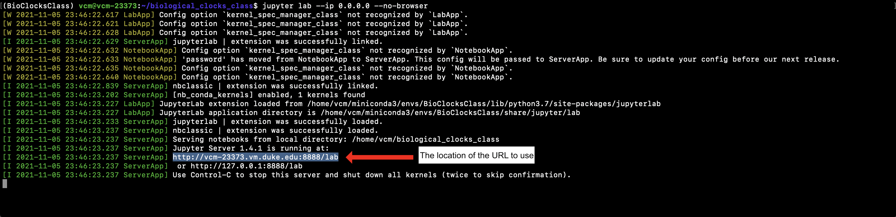

# Biological Clocks class - Virtual Machine Install and Use

This guide shows how to setup a virtual machine (VM) through Duke's Virtual Computing Manager and then install the Biological Clocks Class code repository. The last step shows how to use Jupyter Lab in the VM.

Installation
----
1) Go to Duke's [Virtual Computing Manager](https://vcm.duke.edu/) and click `Reserve a VM`

____
2) Several operating systems are available, but we will be using `Ubuntu Server 20.04` for our VM. Click on `Ubuntu Server 20.04`. 

____
3) A Terms of Use window will appear, click `Agree`.

____
4) You will be brought to the VM management page for your new VM. You will notice a message within a purple box saying that an email will be sent once the VM is ready. This should only take a few minutes. Once you have recieved this email, you may continue on.

____
5) Connect to the VM using SSH.
    * **For Windows Users**, you will need to download software called Putty. Use this link -[Putty download page](https://www.chiark.greenend.org.uk/~sgtatham/putty/latest.html)- to download the 64-bit x86 version by clicking `putty-64bit-0.76-installer.msi`. Install the software.
 
        * Once Putty is installed, open the software. In the `Hostname` field, enter your VM's address. This address can be found on your VM's management page, in the General Information box and next to Hostname, as shown in Step 4's image.
        * Make sure SSH is selected and then click `open` and then click `Accept`. A new window will open. In this new window, enter your netID and hit enter. Next, enter in your netID password and hit enter. **NOTE: you will not be able to see what you type for your password. This is suppose to happen.**
    * **For Mac or Linux Users**, SSH is preinstalled and can be used from within the Terminal. Open up a terminal and enter `ssh netid@VM_address`, where *netid* is your netID and *VM_hostname* is your VM's address. This address can be found on your VM's management page, in the General Information box and next to Hostname, as shown in Step 4's image.
        * After typing in the above command, hit enter. You will be asked a yes/no question, type in `yes` and hit enter.
____  
6) After logging into your VM using SSH, we need to install Anaconda in your VM.  Enter the following commands to do just that:
    ```
    $ sudo apt-get update
    $ sudo apt-get install curl
    $ curl -O https://repo.anaconda.com/miniconda/Miniconda3-latest-Linux-x86_64.sh
    $ bash Miniconda3-latest-Linux-x86_64.sh
    $ source .bashrc
    ```
    * The second to last command will have a few yes/no questions as well as places to hit `ENTER`, answer `yes` or hit `ENTER` to all of them.
___
7) You will need to create a Personal Access Token on GitLab. If you do not already have a gitlab account, you will need to make one first. Go to [GitLab](https://gitlab.com/) to make an account.
    * Logged into your GitLab account, click your profile [1] go to `Preferences` [2].
    
    * Go to the `Access Tokens` [1]. Enter `duke-vm` for the Token name [2] and click the box next to `api` [3]. Click `Create personal access token` [4].
    
    * You will be directed to a new page. Copy the text in the box under `Your new personal access token`. **IMPORTANT: You will need this token for Step 8. Leave this page open. If you close this page, you will not be able to get your token back. If you do close it, you will need to create a new token again.**
___
8) Clone the Biological Clocks Class repository into your VM. Enter the following command in the terminal:
    ```
    $ git clone https://gitlab.com/haaselab/biological_clocks_class.git
    ```
    * You will be prompted for you username and password. For your username, enter your gitlab user name. **For your password, enter the personal access token you created in Step 7, NOT your gitlab account password.**
___
9) Install Biological Clocks Class repository in your VM. Enter the following commands in the terminal:
    ```
    $ cd biological_clocks_class
    $ git submodule init
    $ git submodule update
    $ conda env create -f conda_req.yml
    $ conda activate BioClocksClass
    $ ipython kernel install --user --name=BioClocksClass
    ```
____
10) Since we are in a VM, we need to activate Jupyter Lab using the following command (Remember to have your BioClocksClass conda environment activated first):
    ```
    $ jupyter lab --ip 0.0.0.0 --no-browser
    ```
    * Several messages will be printed in the terminal. The one you care about is the URL that has your VM's address in it. Copy the entire URL and enter it into your browser. In the image below, this URL would be the second to last URL.
    