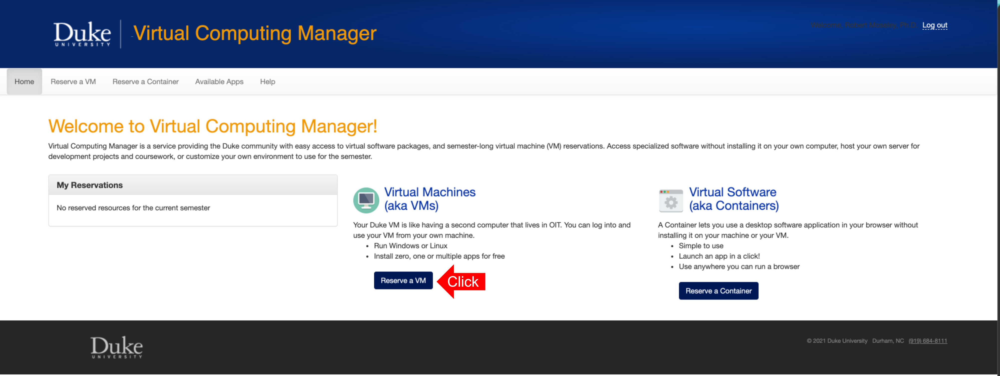
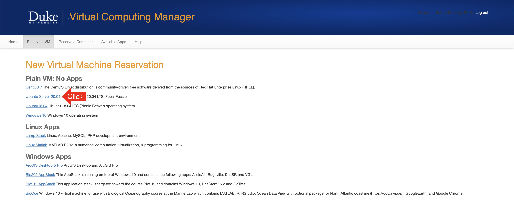
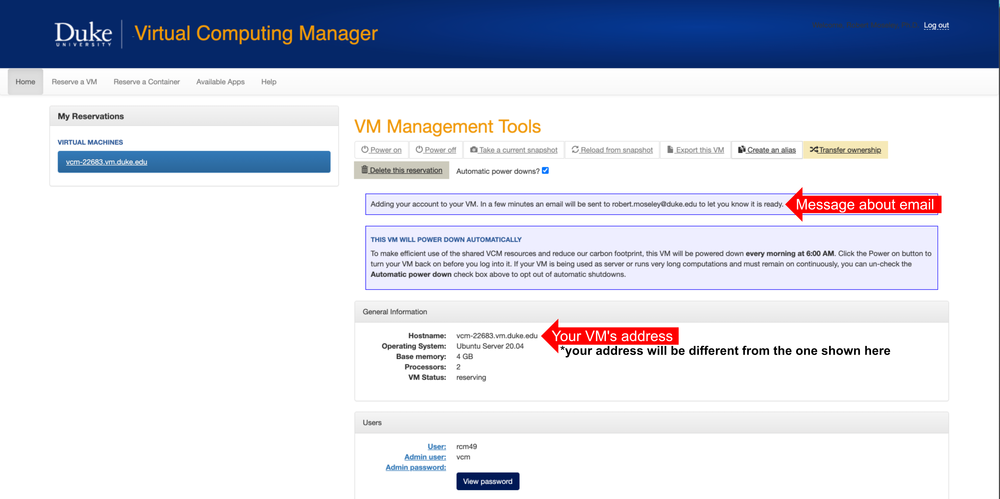
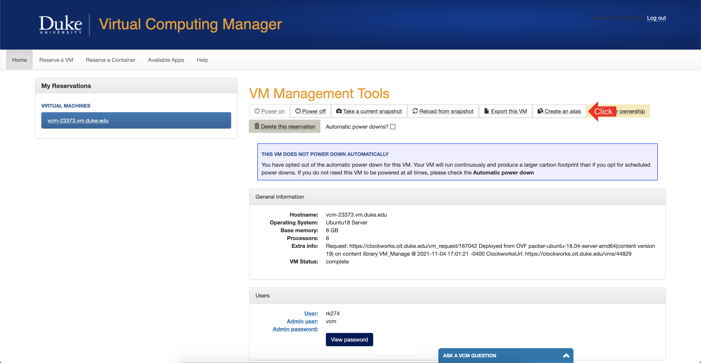
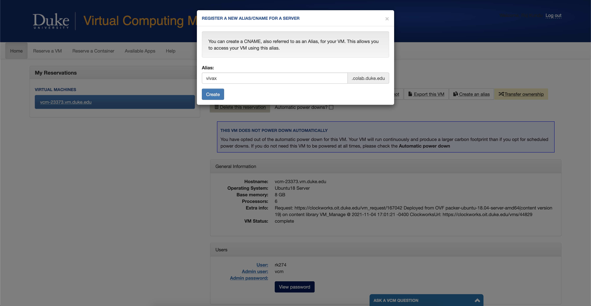
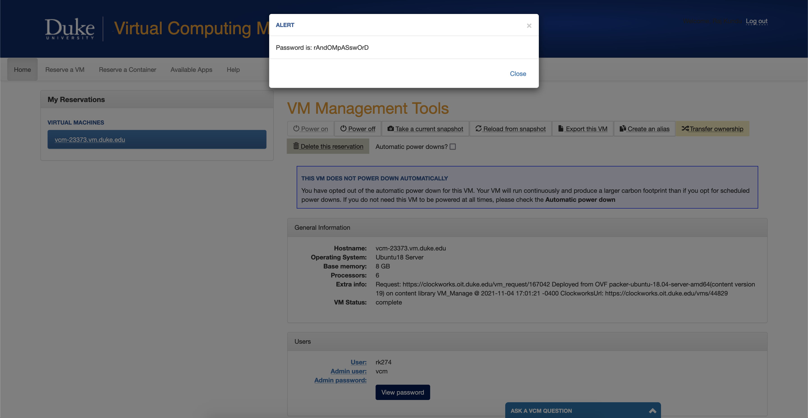
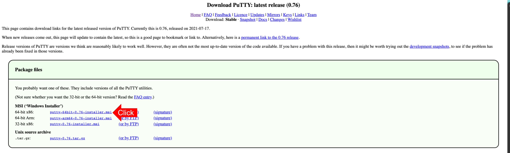
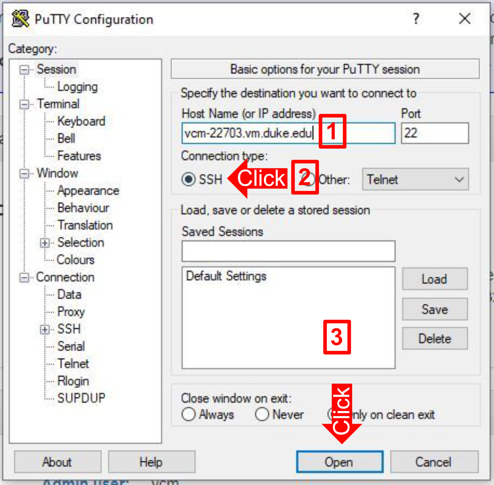
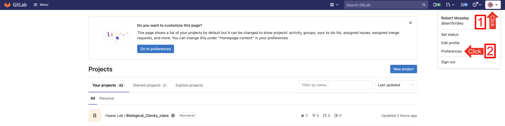
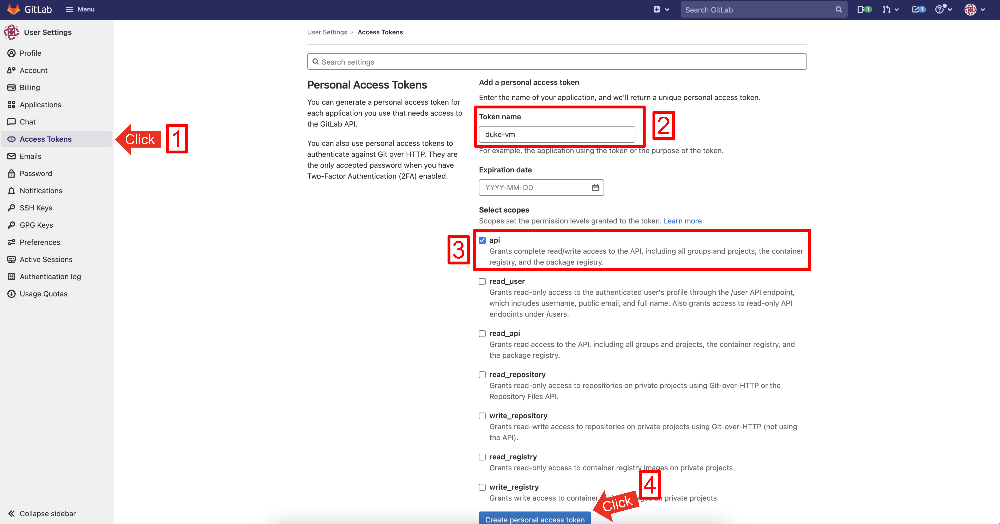

# Biological Clocks class - Virtual Machine Install and Use

This guide shows how to setup a virtual machine (VM) through Duke's Virtual Computing Manager and then install the Biological Clocks Class code repository. The last step shows how to use Jupyter Lab in the VM.

Installation
----
1) Go to Duke's [Virtual Computing Manager](https://vcm.duke.edu/) and click `Reserve a VM`

____
2) Several operating systems are available, but we will be using `BIO 218` for our VM. Click on `BIO 218`. 

____
3) A Terms of Use window will appear, click `Agree`.

____
4) You will be brought to the VM management page for your new VM. You will notice a message within a purple box saying that an email will be sent once the VM is ready. This should only take a few minutes. Once you have recieved this email, you may continue on.

____
## [Optional] Create an alias for your VM
Currently, your VM is located at an address like `vcm-23683.vm.duke.edu`. If you would instead like to use an address like `vivax.colab.duke.edu`, click the "Create an alias" button:

Enter an alias for your VM, such as `vivax` in this example, and click the "Create" button:

**NOTE: Creating the alias may take a few minutes, and you will receive an email when it has been created successfully. Wait for that email before continuing.**

From this point on, you can either refer to your VM with its true address, e.g. `vcm-23683.vm.duke.edu`, or you can also use the alias you created, e.g. `vivax.colab.duke.edu`. The alias works both for SSH and for Jupyter Lab: anywhere you see your VM's address in the following instructions, you can replace *that part of the URL* with the alias.
____
5) Click on the "View Password" button to see the password for the `vcm` user. 

A pop up will appear with the text `Password is: {your password here}`. Save your password somewhere and/or copy it to your clipboard using `Ctrl+C` or `Cmd+C`. You'll need it both for setup and whenever you may need to SSH into your VM.

____
6) Connect to the VM using SSH. You need to be on Duke's campus or, if off campus, connect via [VPN](https://oit.duke.edu/service/vpn/). You also need to make sure that the VM is powered on. By default, Duke VMs power off every morning at 6am. You can Power on from Duke's [Virtual Computing Manager](https://vcm.duke.edu/).
    * **For Windows Users**, you will need to download software called Putty. Use this link -[Putty download page](https://www.chiark.greenend.org.uk/~sgtatham/putty/latest.html)- to download the 64-bit x86 version by clicking `putty-64bit-0.76-installer.msi`. Install the software.
 
        * Once Putty is installed, open the software. In the `Hostname` field, enter your VM's address [1]. This address can be found on your VM's management page, in the General Information box and next to Hostname, as shown in Step 4's image. Make sure SSH is selected [2] and then click `open` [3] and then click `Accept`. A new window will open. In this new window, enter `vcm` and hit enter. Next, enter in the username `vcm` and *the password from Step 5* and hit enter. **NOTE: you will not be able to see what you type when entering your password. This is supposed to happen.**
        
    * **For Mac or Linux Users**, SSH is preinstalled and can be used from within the Terminal. Open up a terminal and enter `ssh vcm@VM_address`, where *VM_address* is your VM's address. This address can be found on your VM's management page, in the General Information box and next to Hostname, as shown in Step 4's image.
        * After typing in the above command, hit enter. You will be asked a yes/no question, type in `yes` and hit enter.
    * You can also try connecting via a Remote Desktop Client which will give your VM UI instead of just being able to connect via a terminal.
____  
7) After logging into your VM using SSH, we need to install Anaconda in your VM.  Enter the following commands to do just that:
    ```
    $ sudo apt-get update
    $ sudo apt-get install curl
    $ curl -O https://repo.anaconda.com/miniconda/Miniconda3-latest-Linux-x86_64.sh
    $ bash Miniconda3-latest-Linux-x86_64.sh
    $ source .bashrc
    ```
    * The second to last command will have a few yes/no questions as well as places to hit `ENTER`, answer `yes` or hit `ENTER` to all of them.
___
8) You will need to create a Personal Access Token on GitLab. If you do not already have a gitlab account, you will need to make one first. Go to [GitLab](https://gitlab.com/) to make an account.
    * Logged into your GitLab account, click your profile [1] go to `Preferences` [2].
    
    * Go to the `Access Tokens` [1]. Enter `duke-vm` for the Token name [2] and click the box next to `api` [3]. Click `Create personal access token` [4].
    
    * You will be directed to a new page. Copy the text in the box under `Your new personal access token`. **IMPORTANT: You will need this token for Step 9. Leave this page open. If you close this page, you will not be able to get your token back. If you do close it, you will need to create a new token again.**
___
9) Clone the Biological Clocks Class repository into your VM. Enter the following command in the terminal:
    ```
    $ git clone https://gitlab.com/haaselab/biological_clocks_class.git
    ```
    * You will be prompted for you username and password. For your username, enter your gitlab user name. **For your password, enter the personal access token you created in Step 8, NOT your gitlab account password.**
___
10) Install Biological Clocks Class repository in your VM. Enter the following commands in the terminal:
    ```
    $ cd biological_clocks_class
    $ git submodule init    
    $ git submodule update
    $ conda update conda
    $ conda config --set channel_priority strict
    $ conda env create -f conda_req.yml
    $ conda activate BioClocksClass
    $ ipython kernel install --user --name=BioClocksClass
    ```
Note: If you are running into issues with conda commands, it may be that you need to add a path to Minoconda. In Putty or in the terminal, connect to the VM and run the following command, which opens a text editor for file .bashrc:
    $vi .bashrc 
Then add the line of code 
    $ export PATH=~/miniconda3/bin:$PATH
somewhere at the top of the file. Save the changes and exit the vi editor by typing :wq. Leave the terminal, start it again and re-connect to the VM. Your conda commands above should now go through. 

_______
Accessing Jupyter Lab
----

You have three options:
1. **Running From the Terminal** (my favorite option/the easiest)
    This method is my favorite and is probably the easiest. Once you've ssh'd into your VM, you just type the following commands:
    ```
    $ cd biological_clocks_class
    $ conda activate BioClocksClass
    $ jupyter lab --ip=0.0.0.0 --no-browser
        ** Note: jupyter notebook and jupyter lab are basically the same thing, just with slightly different UI.
    ```
    

    Then copy and paste the link that it outputs and paste it into your local browser. It should be in the following format:
    http://vcm_number.vm.duke.edu:8888/?token=b510cd19a52da0384048c02ee595a5b1f8755316a363cfc5

2. **Running on a Remote Desktop Client**
    If you are running through a remote desktop client, you can install a browser onto your VM following these instructions: https://linuxize.com/post/how-to-install-google-chrome-web-browser-on-ubuntu-20-04/
    Then you can just type the following commands and a browser window with the jupyter lab should open automatically:
    ```
    $ cd biological_clocks_class
    $ conda activate BioClocksClass
    $ jupyter lab

3. **Accessing your jupyter sever.** 
    This method is a bit more complicated, but when it works is really easy for your team to collaborate. If you're a bit more technically minded, you can try to get this set up.
    Set up a password for jupyter lab as follows:
    1) Run the command below and **enter a password of your choice that all of your team members will share when accessing jupyter lab.**
        ```
        $ jupyter server password
        ```
    
    Now, to set up jupyter lab to run every time the VM turns on, run the following commands:
    ```
    $ sudo chmod a+x ./start_jupyter.sh
    $ sudo cp jupyter.service /etc/systemd/system/
    $ sudo systemctl enable jupyter
    $ sudo systemctl start jupyter
    $ systemctl status jupyter --no-pager --full
    ```
    **You should see green output at this point:** if you see red output, then do not continue on!
    From now on, to access Jupyter Lab...
    1) Ensure that your VM is turned on; if it is not already, then:
        1) Visit [https://vcm.duke.edu/](https://vcm.duke.edu/)
        2) Click on the blue "Log In" button
        3) Click on your VM for this class under "Virtual Machines"
        4) Click the "Power on" button
    2) Once your VM is on, navigate to `http://yourvmaddress.vm.duke.edu` – or, if you created an alias between Steps 4 and 5, then you can simply navigate to `http://youralias.colab.duke.edu`

______
<!-- Moving data between your computer and your VM
---- -->
